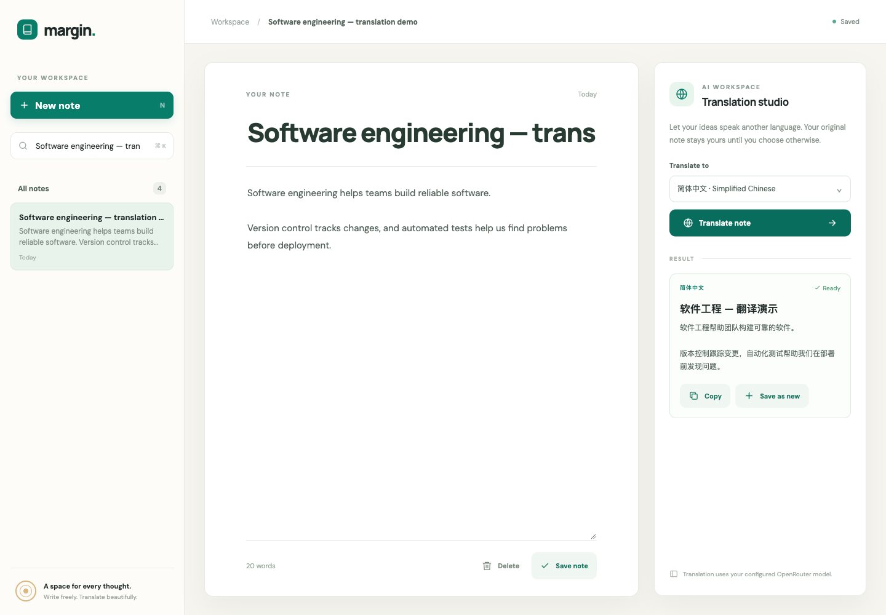

# Task 1 — AI Note Translation App

**Status:** local implementation and real Supabase integration tested; Vercel deployment pending configuration. This is a working draft, not the final submission PDF.

## Application

Margin is a Flask note-taking application based on the Week 4 starter. Users can create, edit, delete and search notes. Notes autosave after editing. The translation studio sends a note to the server, which calls the configured OpenRouter LLM with a translator system prompt and validates a JSON response containing `title` and `content`. A translation is displayed separately from the original and can be copied or saved as a new note.

## Database and deployment implementation

The app supports Supabase PostgreSQL through SQLAlchemy and Psycopg. Connections use SSL, disable prepared statements for transaction pooling, and release connections when requests finish. The repeatable `supabase/schema.sql` initializes the note table; PostgreSQL startup does not create tables. Local development uses SQLite when `DATABASE_URL` is blank.

Vercel uses `app.py` as the Flask entrypoint and serves frontend assets from `public/`. Deployment uses the Vercel CLI through `manage.py deploy`, which synchronizes the server runtime variables and records the deployment URL. Credentials are kept in the ignored `.env` file or Vercel environment variables and are not exposed to the browser.

## Test evidence (2026-10-02)

- 25 automated tests passed, including normal note operations and error paths.
- A local end-to-end smoke test passed using the actual configured OpenRouter model, including translation, saving the translation as a separate note, and checking that the original remained unchanged.
- The browser UI successfully autosaved an English note, displayed a Simplified Chinese translation, and saved it as a new note. No console errors were observed.

On 2026-10-05, the Supabase notes table was initialized, and an end-to-end test using the local Flask server with the real Supabase database and real OpenRouter translation passed. Note CRUD/search, input errors, translation, save-as-new, and original-note preservation were verified. Temporary test notes were removed. Vercel production deployment has not yet been verified.

This screenshot is local evidence. A screenshot from the deployed public app must be added after deployment.

## Required before submission

- [x] Supply the Supabase database connection and initialize its note table.
- [ ] Supply the Vercel account/project configuration and deploy.
- [ ] Make the submitted deployment URL accessible without login.
- [ ] Pass the production smoke test with live translation.
- [ ] Add the production URL and a production translation screenshot.
- [ ] Export the completed response to PDF and include the separately required Task 2 responses.

**Public app URL:**

**Production screenshot:**

**Production test date and result:**
