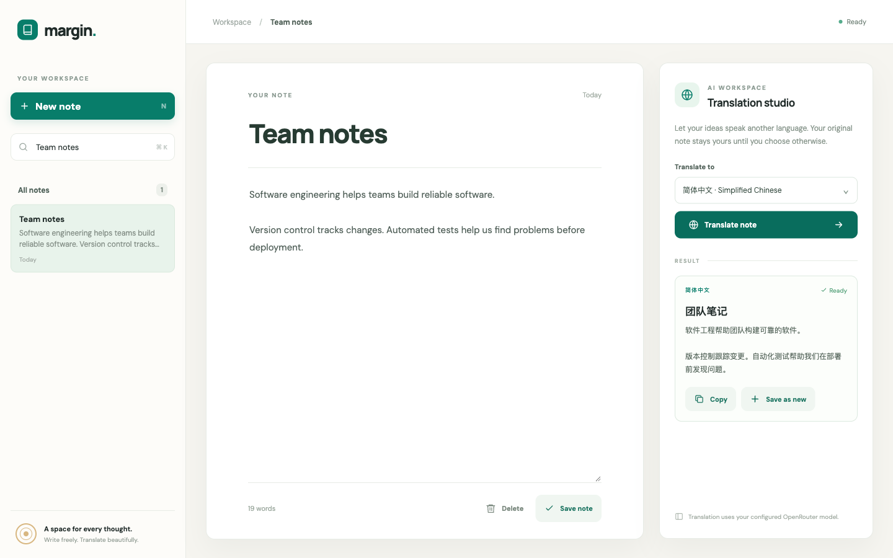

# Task 1 - AI Note Translation App

**Status:** implemented, deployed publicly, and verified on 2026-10-05.

**Public application:** https://ai-notetaker-three.vercel.app

**Source code:** https://github.com/Wenbin-Feng/AI_NoteTaker

Margin extends the Week 4 Flask note-taking starter with AI translation. It supports creating, editing, deleting, searching and autosaving notes. A server-side OpenRouter call translates both title and content into the selected language. The translated note appears beside the original and can be copied or saved as a separate note.

The app stores notes in Supabase PostgreSQL through SQLAlchemy and Psycopg. SSL is enabled, and prepared statements are disabled for the transaction pooler. The repeatable schema is in `supabase/schema.sql`. Vercel runs the Flask entrypoint in `app.py` and serves the frontend from `public/`. Deployment is performed with Vercel CLI authentication; `manage.py deploy` synchronizes runtime environment variables and records the public URL. Login protection is disabled for the submitted production application.

## Verification on 2026-10-05

- 28 automated tests passed, including CRUD, validation, translation failures and paragraph preservation.
- An unauthenticated production smoke test passed against the real Supabase database and OpenRouter model: CRUD, search, invalid-input handling, translation, saving a translation as a new note, preserving the original, and deleting disposable test notes.
- Browser verification displayed the actual Simplified Chinese translation and saved it as a separate note. The original English note remained available.
- Secrets are stored in ignored local environment files and server-side Vercel environment variables. No credentials are embedded in the browser assets or committed source.

## Production evidence

This screenshot was captured from the public production URL on 2026-10-05. It shows the original English title and two paragraphs, the selected target language, the actual translated title and content, and Copy / Save as new controls.

This report covers Task 1 only. Task 2 game/simulator evidence and the Canvas survey remain separate coursework requirements.
